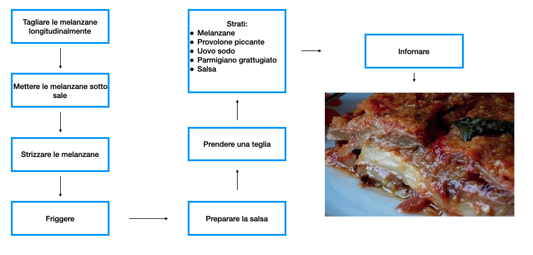
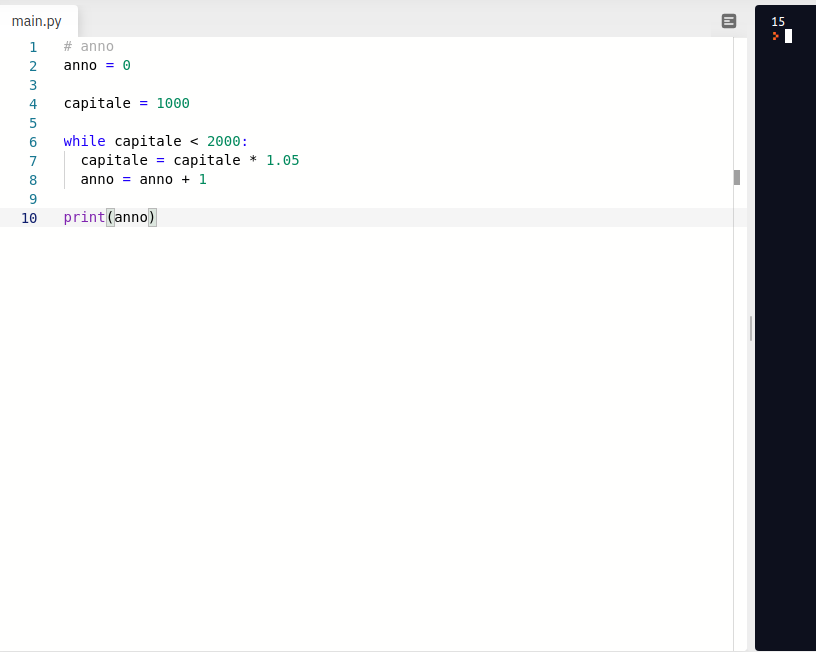
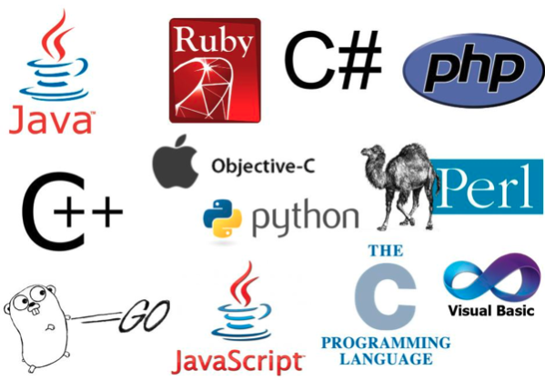
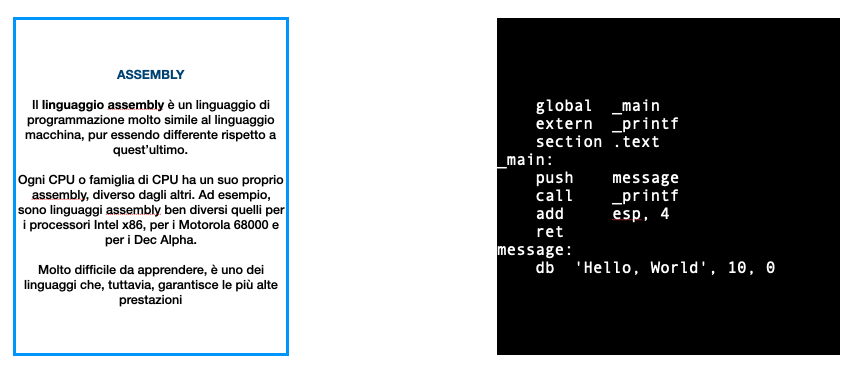
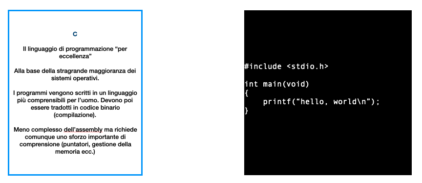
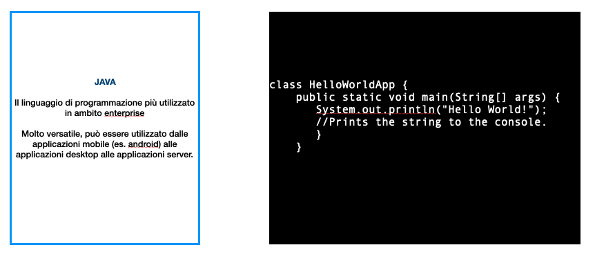
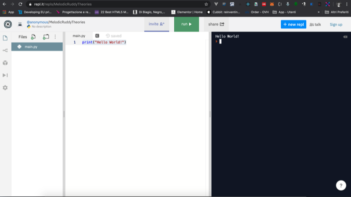

# Introduzione al pensiero computazionale

## Introduzione

Benvenuti al nostro corso di **informatica** per giuristi. 

Il punto di partenza del nostro **percorso** sarà quello di dimostrare che il **giurista** e l'**informatica** non sono necessariamente in antitesi. Anzi, si possono individuare numerose similitudini, soprattutto per quanto attiene al modo in cui **giurista** e **computer** elaborano le informazioni.

La prima **provocazione** che lanciamo è la seguente:

> *Siamo tutti, chi più, chi meno, programmatori*

Perché possiamo affermare questo concetto ? Che cos'è un **programma**?

Il **programma** può essere definito, nella sua eccezione più basilare, come una *sequenza ordinata di istruzioni, funzionalmente preordinata al raggiungimento di uno scopo*. Questa definizione, tuttavia, può essere applicata a numerosissimi campi ed attività della vita di tutti i giorni.

Pensiamo alle **ricette** di cucina. Non sono forse anch'esse delle *sequenze di istruzioni funzionalmente preordinate al raggiungimento di uno scopo*? Facciamo un semplice esempio.

Di fatto, per raggiungere il nostro obiettivo (il timballo di melanzane), dobbiamo necessariamente seguire una serie di *step* secondo un ordine preciso.

Lo stesso ragionamento giuridico può essere, per certi versi, assimilato ad un **programma**.

Prendiamo l'art. 1350 del codice civile. Si tratta della disposizione che prevede una serie di requisiti formali (forma scritta) per la validità di alcuni atti (cd. *forma ad substantiam*) come nel caso dei contratti che hanno ad oggetto beni immobili.

Di conseguenza, il giurista che si trova di fronte ad un contratto *verbale* avente ad oggetto un bene immobile, che ragionamento dovrà porre in essere ?

1. Il contratto ha ad oggetto beni immobili;
2. Ci sono requisiti formali per la validità del contratto? 
3. Sì, perché ai sensi dell'art. 1351 c.c., il contratto deve rivestire la forma scritta;
4. il contratto è **verbale**, quindi, non riveste la forma scritta;
5. il contratto è, pertanto, **nullo**.

Ciò premesso, è possibile rendersi conto di come il ragionamento giuridico e il pensiero computazionale possano avere dei punti di contatto.

Oggi gli *algoritmi* possono eseguire tantissimi compiti:

- possono essere utilizzati per risolvere problemi di calcolo complesso;
- possono essere utilizzati per elaborare e processare grandi quantità di testi;
- possono essere utilizzati per visualizzare e organizzare le informazioni;

Per essere certi di poter scrivere un buon **programma** è, però, necessario comprendere:

1. come analizzare il problema da risolvere;
2. come individuare una sequenza di istruzioni **oggettive**;
3. come individuare la strada più efficiente per risolvere il nostro problema.

Andiamo per ordine.

**Come analizzare il problema da risolvere**. Non tutti i problemi possono essere risolti da una macchina (o, almeno, non oggi). Altri problemi sì. Pensiamo ad un semplice problema di natura finanziaria:

> Se deposito 1.000 euro in banca, con un tasso di interesse annuo del 5%, dopo quanti anni avrò raddoppiato il capitale?

Si tratta di un problema che potrebbe essere risolto con dei calcoli manuali.

Ipoteticamente, sapremmo che al termine del primo anno, avremmo ottenuto 50 euro di interessi (il 5% di 1000 è 50) e, quindi, ci troveremmo con un capitale di 1.050 euro. Il secondo anno, avremmo ottenuto 52,5 euro ecc.

Mettendo i risultati in una tabella

| Anno | Capitale iniziale | Interessi | Capitale finale |
| ---- | ----------------- | --------- | --------------- |
| 1    | 1000              | 50        | 1050            |
| 2    | 1050              | 52,5      | 1102,5          |
| 3    | 1102,5            | 55,125    | 1157,625        |

Come vediamo, è intuitivo che, con il passare degli anni, prima o poi si arriverà alla fatidica soglia dei 2.000 euro.

Questo problema può essere facilmente risolto con un *algoritmo* e, più, precisamente con un **ciclo** (spiegheremo meglio nelle successive lezioni di cosa si tratti).

anno = 0

Finché **capitale **< 2000

​	capitale = capitale x 1,05

​	anno = anno + 1

stampa il valore di anno

In sostanza, stabiliamo che all'anno 0, il capitale sia 1000. Dato che il capitale è inferiore a 2000, viene aumentato del tasso interesse annuo del 5% e si aumenta l'anno di 1. Al termine dell'iterazione, si ripete da capo. Dato che 1.050 è inferiore a 2.000, si aumenta ulteriormente del 5% e si aumenta l'anno di 1.

In **Python**, ossia nel linguaggio di programmazione, forse, più semplice per iniziare a programmare, si scriverebbe più o meno così:

Ed ecco il nostro primo **algoritmo**.

## Linguaggi di programmazione

Quanti linguaggi di programmazione esistono?

Moltissimi.

La principale distinzione è tra:

- **linguaggi compilati** - ad esempio C, C++. Se si utilizzano questi linguaggi:
  1. si scrive il **codice sorgente** in un editor, questo codice viene poi controllato per verificare che non ci siano errori e poi viene **compilato**;
  2. la **compilazione** consiste nella trasformazione di ogni istruzione del programma da **codice sorgente** a linguaggio macchina;
  3. le istruzioni **compilate**, quindi, saranno eseguite direttamente dal processore, con un notevole beneficio in termini di prestazioni
- **linguaggi interpretati** - ad esempio Python, PHP, Javascript. Se si utilizzano questi linguaggi:
  1. si scrive il **codice sorgente** in un editor;
  2. I linguaggi interpretati sono nati dopo quelli compilati dalla **necessità di sviluppare programmi in grado di essere eseguiti su qualsiasi computer**, indipendentemente dal sistema operativo del dispositivo. Questi linguaggi vengono detti interpretati e la loro "traduzione" richiede un passaggio in più che porta inevitabilmente ad un consumo più alto di memoria ed ad una velocità d'esecuzione ridotta rispetto ad uno compilato. Il vantaggio, però, è una maggiore versatilità, in quanto possono essere utilizzati indipendentemente su qualsiasi sistema, mentre quelli **compilati** hanno bisogno di essere, per l'appunto, **compilati** per ogni specifica famiglia di processori.

## Hello World!

Convenzionalmente, il primo programma che si scrive deve avere come unico scopo quello di visualizzare a video **Hello World!**.

Seguirà una breve panoramica di **foto** che riproducono il **codice sorgente** necessario per visualizzare a video **Hello World** in differenti linguaggi di programmazione.

### Assembly

### C

### JAVA

### Python

### Javascript

### Risorse utili per programmare

#### REPL

Si tratta di un editor online per utilizzare i principali linguaggi di programmazione, senza dover installare e/o configurare l'ambiente di sviluppo. 

Come potete vedere nella schermata sottostante, potete scrivere il codice nell'editor posto a sx ed avere l'*output* immediatamente nell'editor di destra.

**Siti contenenti risorse utili**:

- [W3CSchools](https://www.w3schools.com/) - contiene numerossisime risorse utili per imparare HTML, CSS, PHP, SQL, JAVASCRIPT con esercizi e aree di test;
- [Visual Studio Code](https://code.visualstudio.com/) - Editor sviluppato da Microsoft e rilasciato *open source*. 
- [Python - Sito ufficiale](https://www.python.org/) - Sito ufficiale del linguaggio di programmazione Python.

