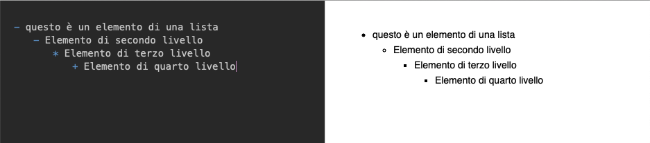
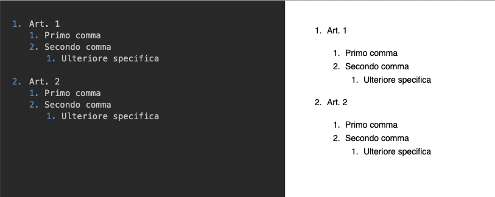
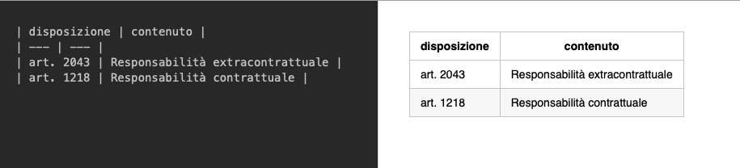

# Markdown

## Introduzione

Markdown è un linguaggio di *markup leggero*, creato nel 2004 ma usato ampiamente da siti e software molto importanti, come GitHub, Facebook, Stack Exchange, ed altri.

Si tratta del linguaggio più utilizzato per la redazione della documentazione tecnica su *Github* e, per le sue caratteristiche intrinseche, potrebbe anche essere utilizzato in ambito legale, congiuntamente allo stesso *Github* per una gestione innovativa della redazione dei contratti.

Ma **che cos'è un linguaggio di markup?**

Si tratta, in sintesi, di un set di regole per aggiungere una struttura ad un documento (ad es. per definire i **titoli** o per aggiungere **formattazione**).

Il vantaggio del *Markdown* è che può essere facilmente convertito in *HTML* o *PDF*.

## Breve Guida al Markdown

### Titoli o Intestazioni

Con **titoli** o **intestazioni** ci riferiamo ai vari *titolo1*, *titolo2* ecc., (che in HTML corrisponderebbero ai tag `h1`, `h2` ecc.

In Markdown creiamo le intestazioni aggiungendo il carattere #, seguito da uno spazio e dal contenuto.

Nell'immagine che segue vedremo a sinistra la formattazione del testo con le regole del *Markdown* e a destra il risultato grafico.

### Formattazione del testo

In *Markdown* si può formattare il testo utilizzando i soli caratteri (`*`,`_`,)

### Le liste in Markdown

Con il *Markdown* è molto semplice creare elenchi puntati e numerati (e combinazioni degli stessi).

Si utilizzano i caratteri `-`,`*`,`+` per gli elenchi puntati (corrispondenti ai tag `<ul>`)

Notare che per avere elementi di differenti livelli è sufficiente utilizzare le tabulazioni sulla tastiera.

Discorso analogo per le liste numerate.

### I Link

La sintassi del link è la seguente:

`[testo del link](url del link)`

Per esempio [questo è il link al sito dello studio legale dell'avv. Roberto Alma](https://kbl-law.com)

### Tabelle

Si utilizzano combinazioni di caratteri `|` e `-`

Questa è una tabella (ne vedremo molte durante il corso)

## Conclusioni

Come avete avuto modo di vedere il *Markdown* è un semplice linguaggio di *markup* che consente di aggiungere struttura e formattazione ai nostri documenti e che, in ambito legale, si presta a numerosi utilizzi interessanti, come ad esempio per la redazione collaborativa di contratti tramite github.