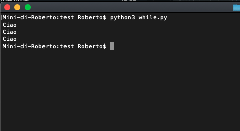
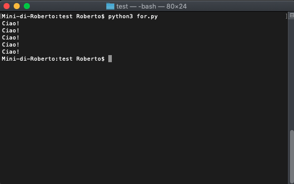
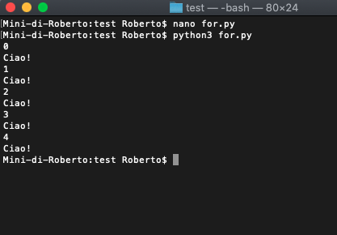
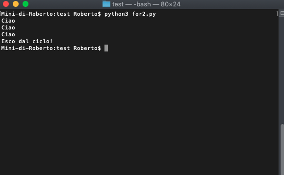
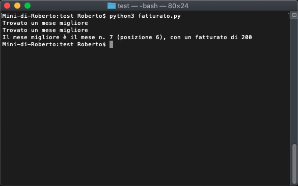
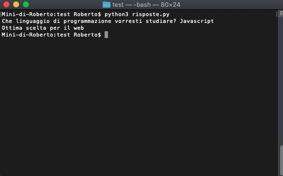
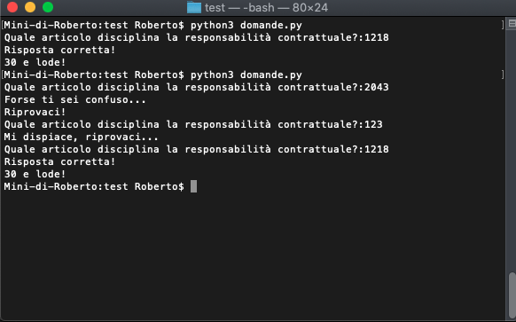

# Controlli di esecuzione del programma

## Istruzioni condizionali

Le **Istruzioni Condizionali** rappresentano una delle fondamentali modalità per il controllo dell'esecuzione del programma e, forse, quella più affascinante per il giurista.

Si tratta del modo con cui il programma potrà **prendere delle decisioni** e si tratta di quanto più vicino esista con il ragionamento giuridico.

Pensiamo al ricorso per decreto ingiuntivo. Il codice di rito prevede che il decreto ingiuntivo possa essere emesso in presenza di una prova scritta.

Nella nostra logica di giuristi, saremmo portati ad effettuare il seguente ragionamento:

- se c'è la **prova scritta** allora deve essere emesso il **decreto ingiuntivo**
- se **non** c'è la **prova scritta** allora il **decreto ingiuntivo** sarà **rigettato**.

In informatica, esiste il costrutto **IF, THEN, ELSE** che, sostanzialmente, opera nello stesso modo.

Vediamo come utilizzare l'istruzione condizionale in **Python**

```python
# IF ELSE
prova_scritta = False

# In python si utilizza if seguito dalla condizione che deve essere verificata seguito da due punti e da una indentazione
if prova_scritta:
		print('Accoglimento decreto')
# Si utilizza else per indicare come si deve comportare il programma se la condizione non si è verificata.
else:
		print('Rigetto Decreto')
```

In questo semplice esempio, abbiamo dichiarato una variabile `prova_scritta` e le abbiamo assegnato un valore di `False`.

Si tratta, ovviamente, di un tipo di dati **Booleano**, che può essere solo `True` o `False`.

Nell'istruzione condizionale, noi sappiamo che la condizione deve essere **vera** o **non vera** (quindi **falsa**). Per questa ragione, è necessario utilizzare i tipi di dati **Booleani**.

Ma attenzione, ciò che conta è che il risultato dell'analisi della condizione sia **vero** o **falso**. Vediamo una serie di esempi.

```python
nome = 'Roberto'
# verifica se il nome è esattamente Roberto
if nome == 'Roberto':
		print('Ciao Roberto')
else:
  	print('Chi sei ?')
```

In questo esempio, abbiamo sostanzialmente chiesto alla macchina di verificare se il **valore** contenuto all'interno della variabile **nome** fosse *Roberto*. Nel caso di avveramento della condizione, avremmo stampato a video un certo messaggio, in caso contrario ne avremmo stampato un altro.

Nel caso di una decisione più complessa, che preveda delle **alternative multiple** possiamo utilizzare l'istruzione `elif` che sta per `else if`. Un semplice esempio chiarisce la questione.

```python
nome = 'Roberto'
# verifica se il nome è esattamente Roberto
if nome == 'Roberto':
		print('Ciao Roberto')
# se il nome non è Roberto, verifica se sia Massimiliano
elif nome == 'Massimiliano':
  	print('Ciao Massimiliano')
# se il nome non è Massimiliano, verifica se sia Marco
elif nome == 'Marco':
  	print('Ciao Marco')
# in tutti gli altri casi
else:
  	print('Chi sei ?')
```

Il codice dovrebbe essere ben comprensibile. Ogni blocco di `if` o `elif` è come se fosse un **ramo**. Quel **ramo** viene eseguito solo se la relativa condizione è vera.

Se il nome è Roberto, esegue l'istruzione contenuta nel primo **ramo**. Altrimenti, si verifica **prima** se si tratti di Massimiliano, **poi** di Marco e, alla fine, si esegue l'istruzione nel ramo, per così dire, **residuale**.

Possiamo anche creare dei **rami** **annidati**. In altre parole dei **rami** che, a loro volta, diano origine ad altri **rami** e, quindi, ad altre alternative. Facciamo, anche qui, un semplice esempio.

```python
nome = 'Roberto'
cognome = 'Alma'
# verifica se il nome è esattamente Roberto
if nome == 'Roberto':
  # in questo caso, SE il nome è Roberto, vado a vedere se il cognome è Alma o Baggio.
		if cognome == 'Alma':
				print('Ciao Roberto Alma')
    elif cognome == 'Baggio':
      	print('Ciao Divin Codino!')
    else:
      	print('Non ti conosco')
# se il nome non è Roberto, verifica se sia Massimiliano
elif nome == 'Massimiliano':
  	print('Ciao Massimiliano')
# se il nome non è Massimiliano, verifica se sia Marco
elif nome == 'Marco':
  	print('Ciao Marco')
# in tutti gli altri casi
else:
  	print('Chi sei ?')
```

Abbiamo un **ramo** che apre altre alternative. Se il nome è *Roberto*, viene verificato anche il valore immagazzinato nella variabile **cognome**.

Ovviamente, non ci sono limiti al numero di **if annidati** che possiamo realizzare. 

### I Cicli

In un **ciclo**, una porzione di codice viene eseguita ripetutamente, fino al raggiungimento di uno specifico obiettivo.

I **cicli** sono frequentemente utilizzati all'interno dei programmi, basti pensare:

- all'esecuzione di una istruzione, su tutti i file di una cartella;
- all'analisi di tutte le parole di un documento;
- all'invio di una mail a tutti gli iscritti ad una particolare lista.

In questa sezione, cercheremo di spiegare i due strumenti che mette a disposizione **python**: il ciclo **while** e il ciclo **for**

#### Il ciclo while

Nel ciclo **while** un determinato blocco di codice viene eseguito finché la **condizione** è **vera**.

Di seguito un esempio semplice di ciclo **while**

```python
# ciclo while
contatore = 0

# finché il contatore è minore di 3, stampa a video Ciao
while contatore < 3:
  print('Ciao')
  # qui aggiungiamo una unità al valore della variabile 		  	contatore
	contatore += 1
```

Vediamo cosa accade, in esecuzione:



Perché è comparso 3 volte Ciao?

Eseguiamo un po' di *debug*:

1. alla prima iterazione, la variabile `contatore` è 0. 0 è minore di 3, dunque stampa Ciao e aumenta il contatore di 1;
2. alla seconda iterazione, la variabile `contatore` è 1. 1 è minore di 3, dunque stampa Ciao e aumenta il contatore di 1;
3. alla terza iterazione, la variabile `contatore` è 2. 2 è minore di 3, dunque stampa Ciao e aumenta il contatore di 1;
4. alla quarta iterazione, la variabile `contatore` è 3. 3 non è minore di 3, dunque il codice non è più eseguito;

> Attenzione, all'errore più classico di tutti: il **ciclo infinito**. Quando si esegue un ciclo, è sempre necessario avere una variabile **contatore**, che va incrementata ad ogni iterazione successiva. Altrimenti, si avrebbe un *ciclo infinito* che lascerebbe il programma in esecuzione, sino al blocco del computer o al suo spegnimento.

#### Il ciclo FOR

Il ciclo **for** consiste nella ripetizione di una istruzione per tutti gli elementi di un oggetto **contenitore** (che può essere una **lista**, una **stringa**, ecc.).

La sintassi è:

*for variabile in contenitore:
		istruzione*

Facciamo un semplice esempio:

```python
# introduciamo la funzione range() che a partire da un numero interno genera una sequenza di numeri.
# es. range(5) -> [0, 1, 2, 3, 4]
for i in range(5):
  	print('Ciao!')
```

Vediamo quante volte stamperà *ciao*



Se volessimo controllare, il valore di `i` ossia dell'**iteratore** (che tiene conto del numero di **iterazioni** eseguite), è sufficiente accedere al valore di `i` all'interno della singola **iterazione**.

```python
for i in range(5):
  	# stampo il valore della variabile i
    print(i)
  	print('Ciao!')
```

Ecco i risultati:



Notare che `i` parte da 0 e arriva a 4, ma complessivamente il ciclo è stato eseguito per 5 iterazioni.

Si può interrompere l'esecuzione del **ciclo** utilizzando l'istruzione `break`, tipicamente, mediante una istruzione condizionale.

```python
for i in range(5):
	if i == 3:
    print('Esco dal ciclo!')
    break
  print('Ciao')
```

Quante volte verrà stampato *Ciao*? 

Ragioniamo insieme:

1. alla prima iterazione, `i` = 0, stampa *Ciao*
2. alla seconda iterazione `i` = 1, stampa *Ciao*
3. alla terza iterazione `i` = 2, stampa *Ciao*
4. alla quarta iterazione `i` = 3, la condizione è verificata, stampa *Esco dal ciclo!* e l'esecuzione si interrompe.

*Ciao* viene stampato 3 volte, nonostante il ciclo sia eseguito per 4 volte. Verifichiamo.



La nostra valutazione è stata corretta!

#### Applicazioni Pratiche

##### Identificazione del mese migliore come fatturato

```python
## applicazione pratica
## vediamo il fatturato di tizio per ogni mese dell'anno
## abbiamo una lista ordinata per mese
fatturato_globale = [100,150,90,30,15,140,200,124,34,50,23,77]
mesi = 12
mese_migliore = 0

for i in range(mesi):
    if fatturato_globale[i] > fatturato_globale[mese_migliore]:
        print('Trovato un mese migliore')
        mese_migliore = i

print(f"Il mese migliore è il mese n. {str(mese_migliore + 1)} (posizione {str(mese_migliore)}), con un fatturato di {fatturato_globale[mese_migliore]}")
```

Ecco l'*output*



##### Risposta a domande

```python
### if, elif, else
### effettuiamo più verifiche

linguaggio = input('Che linguaggio di programmazione vorresti studiare? ')

if linguaggio.lower() == 'javascript':
    print('Ottima scelta per il web')
elif linguaggio.lower() == 'c':
    print('Ottima scelta per grandi performance')
elif linguaggio.lower() == 'java':
    print('Ottimo per lavorare in ambito enterprise')
elif linguaggio.lower() == 'python':
    print('Ottimo per la data science')
else:
    print('Non ho sufficienti informazioni!')
```

Ecco l'*output*



##### Test di diritto civile

```python
## una implementazione divertente
## test di diritto civile
risposta = False

while risposta != True:
                
    risposta = input('Quale articolo disciplina la responsabilità contrattuale?:')
    
    if risposta == '2043':
        print('Forse ti sei confuso...')
        print('Riprovaci!')
    elif risposta == '1218':
        print('Risposta corretta!')
        print('30 e lode!')
        risposta = True
        break
    else:
        print('Mi dispiace, riprovaci...')

```

Ecco l'*output*



