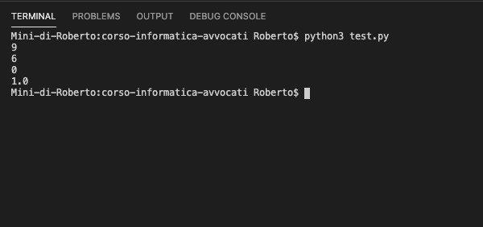
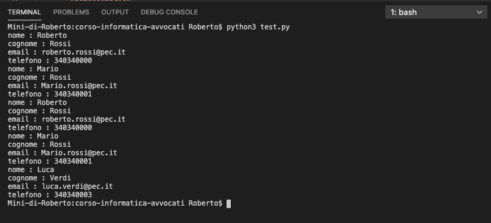

# Le Funzioni

In informatica, le **funzioni** possono essere definite come delle **porzioni di codice** riutilizzabile.

Facciamo un semplice esempio, per spiegare in modo chiaro la situazione. Supponiamo di voler creare una calcolatrice che esegua una delle quattro canoniche operazioni su 2 numeri. Utilizzando le competenze acquisite sino ad oggi, dovremmo scrivere:

```python
numero_a = 2
numero_b = 3
operazione = 'somma'

if operazione == 'somma':
  print(numero_a + numero_b)
elif operazione == 'sottrazione':
  print(numero_a - numero_b)
elif operazione == 'divisione':
  print(numero_a/numero_b)
elif operazione == 'moltiplicazione':
  print(numero_a*numero_b)
  
```

Il codice sopra indicato sarebbe perfettamente valido e funzionante e restituirebbe `5`.

Quale sarebbe, tuttavia, il **problema**?

- Se dovessimo utilizzare più volte la nostra calcolatrice, ci troveremmo a dover duplicare il codice fino a scrivere righe e righe totalmente identiche, con evidenti ripercussioni negative sia sulla leggibilità del codice sia per eventuali errori

Ecco che entrano in gioco le **funzioni**. La sintassi di una **funzione** è:

```python
# def sta per define (è una keyword per far capire al programma che stiamo definendo una funzione)
# somma è il nome della funzione. Utilizzeremo questo nome per invocare la funzione ove necessario
# (a, b) sono i due parametri (possiamo decidere un numero di parametri arbitrario, a seconda delle nostre esigenze)
def somma(a, b):
  # return è un'istruzione speciale. 
  # significa che la funzione restituisce un qualcosa che 		potrà essere stampato a video (con print()) o immagazzinato 	in un'altra variabile
  return a+b

# esempio
# immagazziniamo somma in risultato
risultato = somma(2,3)
# stampiamo il risultato
print(risultato)
```

A questo punto proviamo a riscrivere la nostra calcolatrice.

```python
def calcola(a, b, operazione):
  if operazione == 'somma':
  	return a+b
	elif operazione == 'sottrazione':
  	return a-b
	elif operazione == 'divisione':
  	return a/b
	elif operazione == 'moltiplicazione':
  	return a*b
```

Proviamola, con il seguente codice:

```python
print(calcola(3,3,'moltiplicazione'))
print(calcola(3,3,'somma'))
print(calcola(3,3,'sottrazione')
print(calcola(3,3,'divisione'))
```

Ecco l'output.



Come vedete, la nostra calcolatrice funziona perfettamente!

Adesso, come esercitazione, proviamo a rileggere il codice finale della scorsa lezione e vediamo se riusciamo a utilizzare qualche funzione.

```python
# rubrica stato iniziale
rubrica = [
    {
        "nome":"Roberto",
        "cognome":"Rossi",
        "email":"roberto.rossi@pec.it",
        "telefono":"340340000"
    },
    {
        "nome":"Mario",
        "cognome":"Rossi",
        "email":"Mario.rossi@pec.it",
        "telefono":"340340001"
    }
]
# I° ciclo, iteriamo la lista, per ottenere i singoli elementi che la compongono:
for elemento in rubrica:
    # II° ciclo, iteriamo l'elemento e stampiamo tutte le chiavi valore
    for key in elemento:
        print(f"{key} : {elemento[key]}")
      
## aggiungiamo un elemento alla lista con il noto metodo .append()
rubrica.append({

        "nome":"Luca",
        "cognome":"Verdi",
        "email":"luca.verdi@pec.it",
        "telefono":"340340003"
    })


# I° ciclo, iteriamo la lista, per ottenere i singoli elementi che la compongono:
for elemento in rubrica:
# II° ciclo, iteriamo l'elemento e stampiamo tutte le chiavi valore
    for key in elemento:
        print(f"{key} : {elemento[key]}")
```

Sicuramente la porzione di codice che si ripete è la seguente:

```python
# I° ciclo, iteriamo la lista, per ottenere i singoli elementi che la compongono:
for elemento in rubrica:
# II° ciclo, iteriamo l'elemento e stampiamo tutte le chiavi valore
    for key in elemento:
        print(f"{key} : {elemento[key]}")
```

Proviamo a scrivere una funzione `itera_rubrica(rubrica)` che ci restituisce le coppie chiavi valore di ogni elemento.

```python
# la funzione accetta un solo parametro (rubrica_da_iterare)
def itera_rubrica(rubrica_da_iterare):
		for elemento in rubrica_da_iterare:
      	for key in elemento:
        	print(f"{key} : {elemento[key]}")
```

Riscriviamo il codice di prima.

```python
# la funzione accetta un solo parametro (rubrica_da_iterare)
def itera_rubrica(rubrica_da_iterare):
		for elemento in rubrica_da_iterare:
      	for key in elemento:
        	print(f"{key} : {elemento[key]}")

# rubrica stato iniziale
rubrica = [
    {
        "nome":"Roberto",
        "cognome":"Rossi",
        "email":"roberto.rossi@pec.it",
        "telefono":"340340000"
    },
    {
        "nome":"Mario",
        "cognome":"Rossi",
        "email":"Mario.rossi@pec.it",
        "telefono":"340340001"
    }
]

itera_rubrica(rubrica)
      
## aggiungiamo un elemento alla lista con il noto metodo .append()
rubrica.append({

        "nome":"Luca",
        "cognome":"Verdi",
        "email":"luca.verdi@pec.it",
        "telefono":"340340003"
    })


itera_rubrica(rubrica)
```

E come vediamo, funziona perfettamente!



