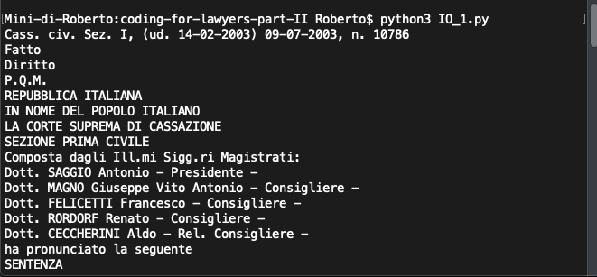
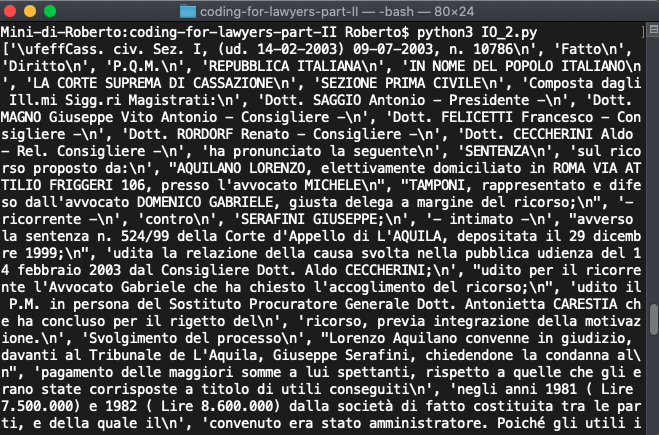
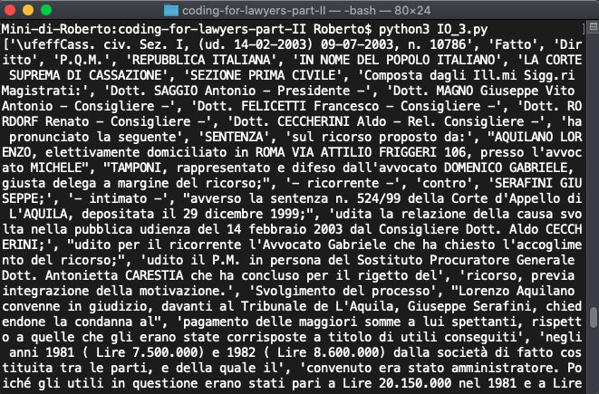
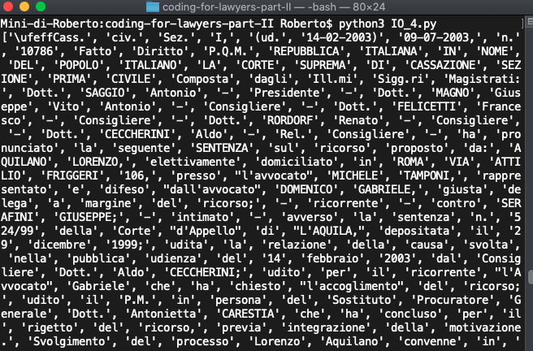
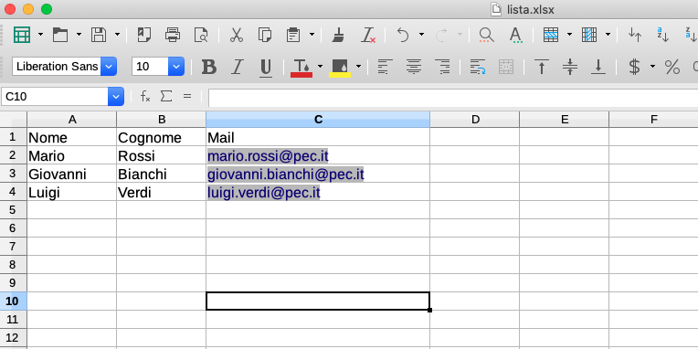
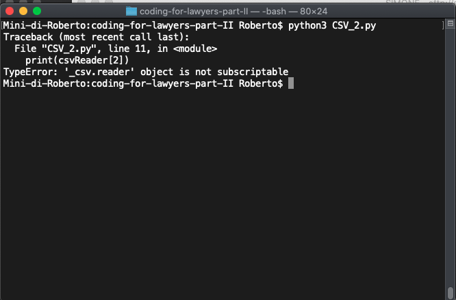
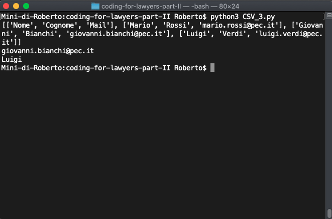
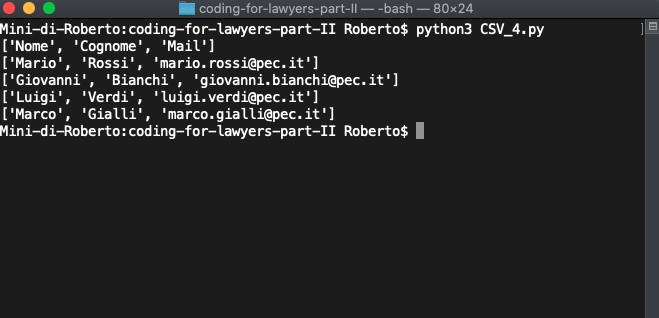

# Lavorare con i File

Una delle principali esigenze della vita professionale è quella di poter elaborare **dati reali**. Questi dati possono essere contenuti all'interno di *file di testo*, *documenti di calcolo* ecc. In questa lezione, vedremo come **Python** metta a disposizione degli strumenti specifici per **lavorare con i file**.

## Lavorare con file di testo

In questa sezione analizzeremo le principali elaborazioni possibili sui **file di testo**, in particolare sui file con estensione `.txt`, vale a dire i **file di solo testo**. Si tratta dei file che possono essere generati con qualunque elaboratore di testo (es. *Notepad*, *Textedit*, ecc.) e che conservono limitatissime informazioni sulla **formattazione**.

### Aprire un file

Per accedere a un *file*, è necessario prima **aprirlo**, utilizzando il suo nome (se il file si trova nella medesima cartella in cui è presente lo *script* in esecuzione) o, nel caso in cui il file si trovi in un'altra cartella, il nome del file, preceduto dal **percorso** della cartella in cui si trova.

> Facciamo un esempio:
>
> - `'sentenza.txt'` si riferisce ad un file situato nella medesima cartella;
> - `'/home/roberto/Documenti/sentenza.txt'` si riferisce ad un file situato nella cartella `/home/roberto/Documenti'`

L'**apertura di un file** comporta la creazione di un **oggetto** di tipo **file**.

L'istruzione *standard* per aprire un file è:

*nomevariabile = **open**('percorsofile', [modalitàapertura])*

Ad esempio, se lavorassimo sul file `sentenza.txt` che si trova nella medesima cartella dello *script*, avremmo:

- `f = open('sentenza.txt', 'r')` apertura del file in modalità **sola lettura**;
- `f = open('sentenza.txt', 'w')` apertura del file in modalità **scrittura** (sovrascrive il contenuto precedente)
- `f = open('sentenza.txt'), 'a')` apertura del file in modalità **aggiungi** (ossia aggiunge alla fine del file)

Nel momento in cui si ha a disposizione l'**oggetto file**, in questo caso `f`. 

A questo punto, potremo utilizzare i metodi propri dell'**oggetto file**, tra i quali, i più comuni sono:

- `read()` che restituisce una stringa contenente l'intero file di testo;
- `readlines()` che restituisce una **lista** contenente tutte le frasi (*intendendosi per frasi, quelle separate dal carattere `\n`, aggiunto automaticamente alla pressione del tasto *enter*);
- `write()` che scrive una **stringa** aggiungendola all'oggetto file.

Terminata l'elaborazione, occorre chiudere l'oggetto file con il metodo `.close()`

Facciamo qualche esempio.

Con il codice che segue, decidiamo di:

1. aprire il file `sentenza.txt`
2. leggerne tutto il contenuto e visualizzarlo a video;
3. chiudere l'oggetto file.

```python
# apre il file
f = open('sentenza.txt', 'r')
# legge il testo
text = f.read()
# chiude il file
f.close()
# stampa il testo
print(text)
```

Ecco l'output.



A questo punto, proviamo a leggere il nostro file, riga per riga.

Utilizzeremo il metodo `readlines()` al posto del metodo `read()`

```python
# estrazione testo da file txt
# Soluzione n. 1 prima aprire file
# il file viene memorizzato in un oggetto file che chiamiamo f

f = open('sentenza.txt', 'r')
# legge il testo e lo trasforma in una lista di righe
lines = f.readlines()
# chiude il file
f.close()
# stampa le righe
print(lines)
```

Ecco l'output.



Come si può vedere, è stata creata una lista di **stringhe**, corrispondente ad ogni **riga** del testo. Lo si comprende perché ogni **stringa** è delimitata da due apici e separata dall'altra mediante una virgola: la tipica struttura della **stringa**.

E per avere la lista delle **righe** senza i caratteri speciali come `\n`?

Si può utilizzare il metodo `.rstrip()` sulla singola **riga**, all'interno di un **ciclo**.

```python
# estrazione testo da file txt
# Soluzione n. 1 prima aprire file
# il file viene memorizzato in un oggetto file che chiamiamo f

# lista vuota conterrà le righe senza il carattere di riga a capo
lines_clean = []

f = open('sentenza.txt', 'r')
# legge il testo e lo trasforma in una lista di righe
# per ogni riga nella lista delle righe
for line in f.readlines():
    # aggiunge la riga pulita alla lista di righe
    lines_clean.append(line.rstrip())
# chiude il file
f.close()
# stampa le righe
print(lines_clean)
```

Vediamo l'*output*.



E se volessimo avere una lista delle sole **parole**?

Entra in gioco un ulteriore metodo delle **stringhe**, ossia il metodo `.split()`. Il metodo `.split()` suddivide una stringa in occasione di un *delimitatore* (che può essere un carattere, più caratteri ecc.) e restituisce una lista di **stringhe**.

Facciamo un esempio. 

*Buongiorno, mi chiamo Roberto e sono un avvocato*.

Posso utilizzare come delimitatore il carattere `e`, utilizzando `.split(' e ')` (notare che ho inserito uno spazio prima e uno spazio dopo).

Otterrò due sottostringhe:

1. *Buongiorno, mi chiamo Roberto*
2. *sono un avvocato*.

Potrei utilizzare come delimitatore `Roberto` (in questo caso senza inserire uno spazio prima e uno dopo ed otterrò):

1. *'Buongiorno, mi chiamo '*
2. *' sono un avvocato'

Se invece non specifico il parametro di `.split()` la nostra stringa verrà *tagliata* in occasione di ogni **spazio**. Ed avremo:

`'Buongiorno,','mi','chiamo','Roberto'` ecc.

Facciamo un esempio sul nostro file.

```python
# estrazione testo da file txt
# Soluzione n. 1 prima aprire file
# il file viene memorizzato in un oggetto file che chiamiamo f

# lista vuota conterrà le parole
wordlist = []

f = open('sentenza.txt', 'r')
# legge il testo e lo trasforma in una lista di righe
# per ogni riga nella lista delle righe
for line in f.readlines():
    # elimina i caratteri di a capo
    line = line.rstrip()
    # divide la stringa in una lista utilizzando come separatore lo spazio
    words = line.split()
    # con il segno + aggiungiamo il contenuto di "words" (che è una lista) ad un'altra lista "wordlist"
    wordlist += words
    
    
# chiude il file
f.close()
# stampa le righe
print(wordlist)
```

Ed ecco l'output.



Spunti ulteriori:

- aggiungere la possibilità di rimuovere i caratteri indesiderati (punteggiatura);
- contare il numero di apparizioni di ogni parola.

## Lavorare con i file CSV

In precedenza abbiamo visto ed illustrato come lavorare con i file testuali. Ora spiegheremo come gestire i fogli di calcolo elettronico (*spreadsheet*).

Siamo tutti solitamente abituati a lavorare con *excel* o eventualmente con *libreoffice* e, quindi, rispettivamente con file di tipo `.xlsx` e/o `.ods`. **Python** dispone di librerie esterne molto potenti per la manipolazione dei suddetti formati di file. A scopo didattico, tuttavia, utilizzeremo una libreria facente parte della cd. **standard library** di Python ossia il modulo `csv`. 

Il modulo `csv`, tuttavia, presuppone che si stia operando con file **CSV** (ossia i cd. *comma separated values*), dove ogni **colonna** è separata da un delimitatore (che in genere è una `,` o un `;`). Fortunatamente, qualsiasi programma di elaborazione di fogli di calcolo può convertire il foglio corrente in formato **CSV**.

Ipotizziamo un foglio di calcolo molto semplice, come nell'esempio seguente.



Abbiamo una riga di *intestazione* e tre righe contenenti i nostri contatti.

Possiamo utilizzare **python** per leggere e/o scrivere su questo file, previa conversione in formato **CSV**.

Le operazioni che dovremo compiere sono:

1. importazione del modulo **csv**
2. creazione di un oggetto file a partire dal nostro file **CSV**
3. creazione di un oggetto **lettore di csv** utilizzando il metodo `.reader()` del modulo **csv** che restituisce un oggetto contenente tutte le righe del **csv**
4. creazione di un **ciclo** per accedere alle singole **righe**.

Vediamo il codice.

```python
# importo il modulo csv
import csv

# apro il file CSV (in modalità lettura)
infile = open('lista.csv', 'r')

# creo l'oggetto lettore di csv che conterrà tutte le righe
csvReader = csv.reader(infile)

# ciclo per stampare ogni riga
for row in csvReader:
    print(row)
```

Vediamo cosa ci restituisce il sistema


Come possiamo vedere, per ogni **riga** ci viene restituita una **lista**, contenente i valori di ogni singola colonna. Trattandosi di una **lista**, possiamo accedere al singolo valore utilizzando il suo indice.

|            | posizione 0 | posizione 1 | posizione 2             |
| ---------- | ----------- | ----------- | ----------------------- |
| **Riga 0** | Nome        | Cognome     | Mail                    |
| **Riga 1** | Mario       | Rossi       | mario.rossi@pec.it      |
| **Riga 2** | Giovanni    | Bianchi     | giovanni.bianchi@pec.it |
| **Riga 3** | Luigi       | Verdi       | luigi.verdi@pec.it      |

Ad esempio per visualizzare la mail di Giovanni Bianchi, dobbiamo accedere alla riga in posizione **2** e all'elemento in posizione **2**. 

Di seguito alcuni esempi:

```python
# mail di giovanni
print(csvReader[2][2])

# nome del sig. verdi
print(csvReader[3][0])
```

Output.



Abbiamo una eccezione. Il sistema ci dice che non possiamo accedere alle righe dell'oggetto `csvReader`. 

Una soluzione potrebbe essere quella di creare una lista vuota ed aggiungere ogni riga.

```python
righe = []
for row in csvReader:
  righe.append(row)
  
print(righe)

print(righe[2][2])

print(righe[3][0])
```

E ora funziona!



Se volessimo aggiungere dei record al file ?

Ci sono varie possibilità (non ce n'è una migliore di un'altra, come spesso avviene in informatica)

Potremmo aggiungere una nuova **riga** alla lista `righe` che abbiamo prima generato.

```python
righe.append(['Marco','Gialli','marco.gialli@pec.it'])
```

A quel punto, potremmo aprire di nuovo il file `lista.csv` in modalità `'w'` che sovrascriverà il relativo contenuto.

```python
# apro il file in modalità scrittura
outfile = open('lista.csv','w')
# creo oggetto scrittore di csv
csvWriter = csv.writer(outfile)
for row in righe:
  # scrivo ogni riga all'interno del file (sovrascrivendo il contenuto)
  csvWriter.writerow(row)

# chiudo il file
outfile.close()
```

E successivamente, riaprire il file per vedere il contenuto.

```python
# riapro il file CSV (in modalità lettura)
infile = open('lista.csv', 'r')
# creo l'oggetto lettore di csv che conterrà tutte le righe
csvReader = csv.reader(infile)

# per ogni riga
for row in csvReader:
  # visualizzo riga
  print(row)
```

Vediamo l'output.



Ottimo! come vediamo *Marco Gialli* è stato inserito nel file.