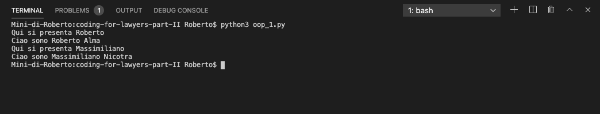
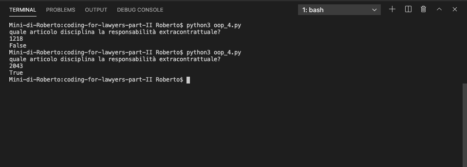
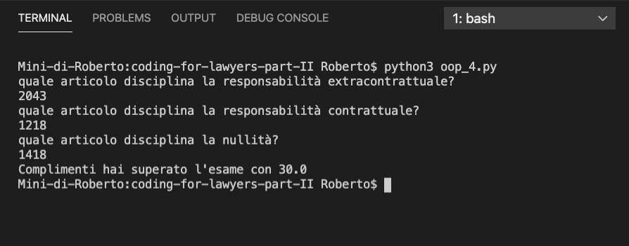

# Classi e oggetti

La **Programmazione ad oggetti** è un paradigma di programmazione che consente di dare vita ad **oggetti** che siano in grado di interagire gli uni con gli altri.

I principali vantaggi della **programmazione ad oggetti** sono rappresentati da:

- possibilità di modellare **oggetti** sulla falsariga di quelli del mondo reale;
- migliore gestione di progetti di grandi dimensioni;
- migliore riusabilità del codice

> Abbiamo sempre detto che le Stringhe, i Numeri sono **tipi di dati**. A questo punto è bene precisare che, più correttamente, si tratta di **oggetti** che consentono di sfruttare specifici **metodi**.
> Ad esempio, 'Roberto' è un oggetto di tipo **stringa** che consente di accedere a propri **metodi** come `lower()` o `upper()`. 23 è un **oggetto** di tipo **int** (ossia numero intero). 23.5 è un **oggetto** di tipo **float**.
>
> Per verificare che tipo di oggetto sia una determinata informazione si utilizza la funzione `type('Roberto')`. In questo caso vogliamo sapere a che tipo di **oggetto** è associata l'informazione 'Roberto'. Il sistema ci dirà che si tratta di `<class 'str'>` ossia di una **stringa**.

In **Python** possiamo facilmente creare nuovi **oggetti**. Per fare ciò introduciamo il concetto di **classe**.

La **classe** è un **tipo di dato astratto** utilizzato per descrivere la struttura di elementi del mondo reale che condividono caratteristiche simili. Un **oggetto** è una istanza di una determinata **classe** o, più semplicemente, è un elemento che appartiene ad una determinata **classe**.

Per fare un semplice esempio:

- `Cane` può essere una classe che descrive il comportamento di esseri viventi che condividono determinate caratteristiche (es. il fatto di avere quattro zampe, abbaiare ecc.)
- `Pluto` può essere un cane, quindi un appartenente alla classe dei `Cani`.

Altro esempio:

- `Persona` è la classe che descrive gli esseri umani;
- 'Roberto' è un appartenente alla classe delle Persone.

Che scopo ha definire una classe e i vari oggetti?

Il vantaggio dell'utilizzo della **programmazione ad oggetti** è quello di avere **oggetti** che abbiano a disposizione stesse caratteristiche e stessi **metodi**. Abbiamo già avuto modo di sperimentare la comodità del **metodo** `.lower()` su una **stringa**, in quanto ci consente di trasformare la **stringa** in caratteri minuscoli.

Proviamo a creare la **classe** delle Persone. Vogliamo fare in modo che:

- ogni Persona abbia un nome e un cognome;
- ogni Persona possa presentarsi (dicendo il proprio nome e cognome)
- ogni Persona possa salutare (dicendo semplicemente 'Ciao Ciao')

```python
# in questa sezione introduciamo la programmazione ad oggetti
# si tratta di un paradigma in cui i vari compiti da svolgere sono affidati ad oggetti che cooperano tra di loro
# abbiamo classi ed oggetti
# una classe definisce un insieme di oggetti che hanno lo stesso comportamento
class Persona():
    # init è la funzione costruttrice 
    # si tratta della funzione che consente di creare il nostro oggetto
    # @param nome il nome della persona
    # @param cognome il cognome della persona
    # @param self è la referenza all'oggetto che andremo a creare
    # durante l'invocazione della funzione costruttrice, potremo assegnare al nostro oggetto 			due proprietà: nome e cognome
    def __init__(self, nome, cognome):
        self.nome = nome
        self.cognome = cognome

    def presentati(self):
      	# in questo caso self ci consente di accedere alle proprietà dell'oggetto
        # ossia al nome e al cognome
        print(f"Ciao sono {self.nome} {self.cognome}")

    def saluta(self):
        print('Ciao Ciao')

r = Persona('Roberto', 'Alma')

r2 = Persona('Massimiliano', 'Nicotra')

print('Qui si presenta Roberto')
r.presentati()

print('Qui si presenta Massimiliano')
r2.presentati()

```

Proviamo ad eseguire il codice.



Come possiamo vedere i nostri **oggetti** `r` ed `r2` si sono presentati con successo ed in modo corretto. Dunque la nostra nuova **classe** `Persona` è operativa.

## Esercitazione Pratica per giuristi

Supponiamo di voler realizzare un programma per la gestione di un esame di diritto.

Ecco i requisiti funzionali:

- abbiamo bisogno di almeno 3 domande con le relative risposte corrette;
- per semplicità, durante l'esame saranno proposte solo quelle tre domande;
- per semplicità, la risposta corretta sarà solo quella identica a quella salvata;
- abbiamo bisogno anche della stampa a video dell'esito dell'esame.

Iniziamo a programmare. Abbiamo detto che necessitiamo di n. 3 domande, per cui la prima entità che dovremo creare è proprio la Domanda. Diciamo che la Domanda dovrà avere almeno due proprietà: 

- il testo della domanda;
- il testo della risposta corretta;

```python
# classe Domanda
# @param testo - il testo della domanda
# @param risposta - il testo della risposta
class Domanda:
  	def __init__(self, testo, risposta):
      	self.testo = testo
        self.risposta = risposta
```

Supponiamo di voler aggiungere un metodo `stampaDomanda()` che aiuti l'esaminatore a conoscere il testo della domanda e quello della risposta e che sarà utile per noi per testare il funzionamento della classe.

```python
class Domanda:
  	def __init__(self, testo, risposta):
      	self.testo = testo
        self.risposta = risposta
        
    def stampaDomanda(self):
    		print(f"La domanda è: {self.domanda}\n La risposta è: {self.risposta}")
```

Creiamo una domanda con:

`d1 = Domanda('quale articolo disciplina la responsabilità extracontrattuale?', '2043')`

E invochiamo il metodo `d1.stampaDomanda()` per verificarne la correttezza


A questo punto siamo riusciti a creare un oggetto appartenente alla classe `Domanda()` che abbiamo nominato `d1` e abbiamo verificato che le proprietà `testo` e `risposta` sono state inserite e salvate correttamente.

Dobbiamo, quindi, aggiungere un **metodo** per gestire le possibili risposte dell'esaminando. Ci sono varie soluzioni. Per adottare un approccio molto semplice, agiremo in questo modo:

- chiederemo all'utente di inserire la risposta, utilizzando l'istruzione  `input()` che abbiamo già avuto modo di studiare;
- verificheremo se la risposta coincida o meno con quella corretta:
  - nel caso di risposta corretta, restituiremo `True`
  - nel caso contrario, `False`

```python
class Domanda:
  	def __init__(self, testo, risposta):
      	self.testo = testo
        self.risposta = risposta
        
    def stampaDomanda(self):
    		print(f"La domanda è: {self.domanda}\n La risposta è: {self.risposta}")
        
    def rispondi(self):
      	# ricordiamo che input accetta un parametro testuale (che sarà il testo visualizzato 					all'utente) che, nel nostro caso, sarà rappresentato dal testo della domanda 				 (self.testo)
      	risposta = input(f"{self.testo}\n")
        if self.risposta == risposta.lower():
            return True
        else:
            return False
```

Proviamo a invocare il metodo `.rispondi()` sulla nostra domanda `d1`.



Come vediamo, il sistema risulta funzionare perfettamente.

A questo punto, dobbiamo gestire l'esame.

La struttura potrebbe essere:

- una proprietà domande (che dovrebbe essere costituita da una lista di `Domande`)
- una proprietà risposte corrette (che dovrebbe essere inizializzata a 0)
- un metodo che iteri le domande e salvi le risposte, aggiungendo 1 alle risposte corrette in caso di risposta corretta (ossia quando il metodo `rispondi()` della singola domanda restituisca `True`)
- un metodo  `stampaEsito()` che calcoli il numero di risposte corrette su tutte quelle che sono state fornite dall'esaminando e lo promuova in caso di voto almeno pari a 18.

A questo punto, procediamo a definire la nostra classe `Esame`

```python
class Esame:
  # la classe Esame si aspetta come parametro una lista di Domande (che dovremo aver generato prima)
    def __init__(self, domande):
        self.domande = domande
        # il valore risposte corrette, di default è inizializzato a zero
        self.risposte_corrette = 0
    # per ogni domanda viene invocato il metodo .rispondi() che abbiamo generato prima.
    
    def stampaEsito(self):
        voto = (self.risposte_corrette / len(self.domande))*30
        if voto > 18:
            print(f'Complimenti hai superato l\'esame con {str(voto)}')
        else:
            print(f'Mi dispiace, hai conseguito solo {str(voto)}, riprova!')
 
    def svolgiEsame(self):
        for domanda in self.domande:
            risultato = domanda.rispondi()
            if risultato:
                self.risposte_corrette += 1
				# subito dopo aver terminato l'esame stampiamo l'esito, invocando il metodo `.stampaEsito()` dell'oggetto corrente.
        self.stampaEsito()

```

A questo punto, inseriamo 3 domande, con le relative risposte e avviamo un esame.

```python
# creiamo tre oggetti Domanda (per ciascuno inseriamo domanda e risposta corretta)
d1 = Domanda('quale articolo disciplina la responsabilità extracontrattuale?', '2043')
d2 = Domanda('quale articolo disciplina la responsabilità contrattuale?', '1218')
d3 = Domanda('quale articolo disciplina la nullità?','1418')

# creiamo un oggetto Esame che si attende una lista di domande (utilizziamo un oggetto di tipo lista)
esame1 = Esame([d1, d2, d3])
# invochiamo il metodo svolgiEsame()
esame1.svolgiEsame()
```

Verifichiamo l'esito dell'esame e, *in bocca al lupo!*.



Ottimo! abbiamo superato l'esame.

