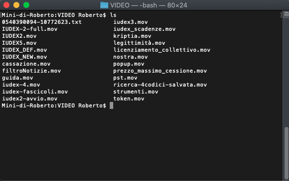
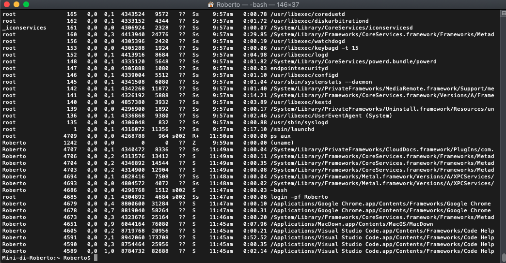
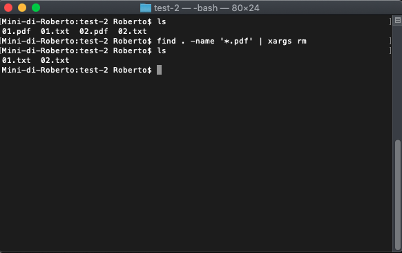
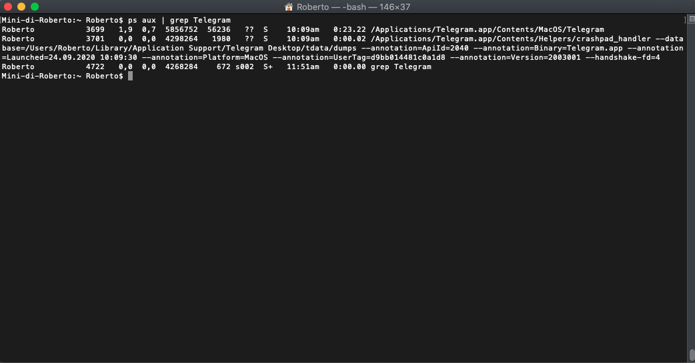
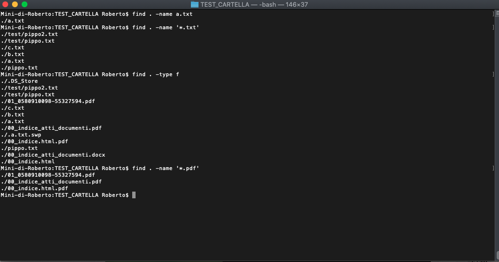
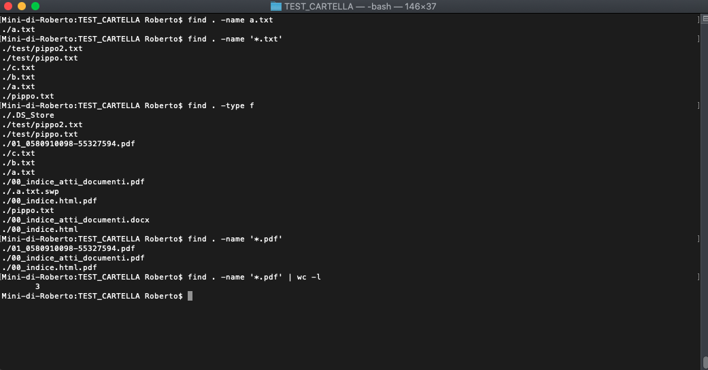
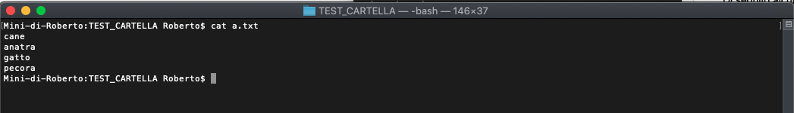

# Introduzione ai comandi da shell

## La Shell

Che cos'è la *shell*?. Il termine *shell* significa letteralmente *guscio* e possiamo definirla come l'interfaccia tra l'utente e il sistema operativo.

Nei sistemi *UNIX*, specialmente lato *server*, è fondamentale imparare come gestire un sistema tramite interfaccia a linea di comando (in luogo della più intuitiva interfaccia grafica o GUI).

Da un punto di vista semplicistico la *shell* è un programma e come tale deve essere eseguito. Al riguardo, ci sono due possibilità:

- esecuzione di una *shell* tramite interfaccia grafica avviando il cd. *terminal*;
- esecuzione di una *shell* direttamente da linea di comando (tipicamente ciò avviene nell'ambito di una procedura di autenticazione ad un server remoto via *SSH*).

Ci sono ovviamente varie tipologie di *shell*, la più famosa delle quali è la *shell BASH* (Bourne Again Shell).

## Esecuzione di programmi nella shell

### Introduzione

Nei sistemi Linux, i programmi eseguibili vengono solitamente salvati in alcune cartelle come `/bin`, `/usr/bin` e `/usr/local/bin`. Se un programma è salvato in una di queste cartelle, può essere eseguito all'interno di una *shell*, semplicemente digitando il nome e premendo INVIO.

Ad esempio, il comando `ls` che restituisce, come output, la lista dei file e delle cartelle contenuti in una cartella, come da immagine che segue



> La lista delle cartelle all'interno delle quali la *shell* ricercherà i comandi da eseguire è solitamente contenuta nella variabile `$PATH`

### Argomenti

Molti programmi accettano **argomenti** che possono essere altri comandi o più semplicemente codici che seguono il nome del programma.

Ad esempio, il comando `cat` è in grado di stampare all'interno del terminale il contenuto di un file di testo. 

Quale file di testo?

Esattamente il file di testo che è indicato come **argomento** del comando.

Un semplice esempio chiarisce la tematica.
```
$ cat a.txt
Questo è il contenuto di a.txt
```

Il comando come abbiamo visto visualizza a video il contenuto del file di testo.

> **Attenzione!**. Se il file di testo non si trova nella stessa cartella di lavoro, il comando restituirà un errore. Nel qual caso si dovrà indicare il percorso completo del file.

### Redirezione dell'input o dell'output

La redirezione dell'*input* e dell'*output* è una delle funzioni più utili da apprendere quando si intende lavorare con una interfaccia a linea di comando.

**Spiegare che cosa è input e output**

Per eseguire la redirezione del contenuto di un file come *input* di un comando o redirezione dell'*output* di un comando (esempio la lista dei file contenuti in una cartella) si usano degli operatori, denominati **operatori di redirezione**.

| Operatore | Descrizione |
| --- | --- |
| `>` | Crea un nuovo file contenente la redirezione dell'output. Se il file esiste viene sovrascritto |
| `>>` | Aggiunge l'output alla fine del file |
| `<` | Invia il contenuto del file specificato come standard input.|

Di seguito un esempio di *redirezione dell'output*


### L'operatore PIPE

Con l'utilizzo dell'operatore `pipe` lo *standard output* di un comando è redirezionato come *standard input* del comando successivo.

Il metodo per utilizzare l'operatore di `pipe` è quello di apporre una barra verticale (`|`) tra i due comandi.

Il caso più semplice è quello di filtrare una lunga lista di dati.



Nella schermata che precede si nota il risultato dell'esecuzione del comando `ps aux` che restituisce in modo leggibile tutti i processi attivi sul sistema. Come potete vedere, si tratta di una lista poco leggibile.

Supponiamo di voler conoscere quale sia il processo corrispondente all'applicazione Telegram Desktop.

Si può digitare il comando 

`ps aux | grep Telegram`

In questo caso, l'utilizzo dell'operatore `pipe` consente di utilizzare l'*output* del primo comando (ossia la lista dei processi) come l'oggetto della ricerca da parte del programma `grep` che, quindi, filtrerà la lista dei processi e restituirà solo quello corrispondente a Telegram Desktop (come da immagine sottostante).

Un altro utilizzo molto frequente dell'operatore di `pipe` è in combinazione con il comando `xargs`. In questo modo si può generare un comando a partire dallo *standard input*.

Ad esempio, si può creare un comando che cancelli tutti i file che soddisfino determinate caratteristiche. 

Nel seguente esempio vogliamo cancellare da una cartella tutti i file di tipo *pdf* (spiegheremo successivamente nel dettaglio il funzionamento dei comandi `find` e `rm`).



Con il comando `find . -name '*.pdf' | xargs rm`

è come se avessimo chiesto:

*trova tutti i file pdf e successivamente cancellali uno per uno*


## Lista dei comandi principali

### Gestione dei file

#### Ottenere la lista dei file e delle cartelle

Si utilizza il comando `ls` già visto sopra. Di seguito una lista delle opzioni più comuni.

| Opzione | Descrizione |
| --- | --- |
| `--all` o `-a` | Normalmente `ls` omette i file nascosti (ossia quelli preceduti dal carattere `.`. L'aggiunta dell'opzione in questione consente la visualizzazione a video del nome dei file nascosti contenuti nella cartella di lavoro |
| `-l` | Visualizza ulteriori informazioni sui file (come i permessi, le dimensioni e la data di creazione) |
| `--recursive` o `-r` | Visualizza i contenuti della cartella in modo ricorsivo. Ciò significa che se la cartella contiene altre sottocartelle, saranno visualizzati anche tutti i file contenuti nelle sottocartelle e così via |

#### Modifica della cartella di lavoro

Si utilizza il comando `cd` seguito dal percorso della cartella che si vuole utilizzare come cartella di lavoro.

Esempio: 

```
cd Documenti/pippo
```
Modifica la cartella di lavoro, da quella corrente a `./Documenti/pippo` 

> Importante è comprendere la struttura dei percorsi.
> 
> Un percorso `assoluto` è un percorso che è relativo alla cartella origine (ossia la cartella `/` )
> 
> Un percorso `relativo` è un percorso relativo alla cartella corrente.
> 
> Ad esempio se mi trovo nella cartella `Documenti/clienti` e voglio accedere a `Documenti/clienti/pippo` potrò semplicemente digitare `cd pippo`. In questo caso sto utilizzando un percorso relativo.

#### Creazione di file

Si utilizza il comando `touch` seguito dal nome del file che si vuole creare.

Con l'istruzione `touch appunti.txt` , ad esempio, stiamo invocando la creazione del file `appunti.txt` all'interno della cartella di lavoro corrente.

#### Copia di file 

Si utilizza il comando `cp` per eseguire la copia di un file.

Nella tabella seguente si illustrano alcuni comandi di esempio molto comuni.

| Comando                | Effetto                                                      |
| ---------------------- | ------------------------------------------------------------ |
| `cp a.txt b.txt`       | Copia il file `a.txt` in `b.txt` sempre all'interno della cartella di lavoro corrente |
| `cp a.txt pippo/`      | Copia il file `a.txt` all'interno della cartella `pippo` . La copia si chiamerà sempre `a.txt` |
| `cp a.txt pippo/b.txt` | Copia il file `a.txt` all'interno della cartella `pippo` . La copia si chiamerà Ci s `b.txt` |

Ci sono, tuttavia, delle considerazioni da fare.

Pensiamo al semplice comando `cp a.txt pippo/`. Cosa accade se `pippo` non esiste o è un file?

- Se `pippo` è una cartella, come abbiamo già visto il risultato sarà il salvataggio di `a.txt` all'interno della cartella `pippo`
- Se `pippo` non esiste, il risultato sarà un nuovo file chiamato `pippo` che sarà identico all'originale `a.txt`
- Se `pippo` è un file, l'esecuzione del comando di cui sopra sovrascriverà i contenuti del file.

Di seguito, si indicano alcune opzioni utili per modificare il comportamento del comando `cp`

| Opzione              | Descrizione                                                  |
| -------------------- | ------------------------------------------------------------ |
| `-f` o `--force`     | Forza la sovrascrittura dei file esistenti, senza chiedere istruzioni all'utente |
| `-R` o `--recursive` | Se si utilizza questa opzione e si utilizza come primo argomento del comando una cartella invece di un file, l'intero contenuto della cartella viene copiato all'interno del percorso di destinazione. |
| `-u` o `--update`    | Il file verrà copiato solo se è più recente di quello di destinazione o se quello di destinazione non esiste. |

#### Spostare o rinominare i file

Si utilizza il comando `mv` sia per spostare che per rinominare i file.

Ad esempio, l'istruzione: `mv a.txt pippo/` sposta il file `a.txt` all'interno della cartella `pippo`.

Invece, l'istruzione `mv a.txt b.txt` rinominerà il file `a.txt` in `b.txt`.

#### Creazione di collegamenti

Spesso è utile creare più collegamenti a uno stesso file, invece di avere più copie dello stesso file.

Con il comando `ln` possono essere creati sia **collegamenti simbolici** (utilizzando l'opzione `-s`) sia **collegamenti fisici**. Vediamo le differenze:

- **collegamento fisico**, si tratta di un collegamento che permette al sistema di riferirsi al contenuto di un file. Nei sistemi Unix, per ogni file o cartella, viene mantenuto un identificativo univoco, denominato `inode` e un conteggio dei collegamenti fisici che vi fanno riferimento. Quando si cancella un file, in realtà, si sta cancellando un riferimento all'`inode` del file. Lo spazio occupato dai dati può essere liberato solo quando il numero di collegamenti fisici di quel file diventa zero.
- **collegamento simbolico**, si tratta di un collegamento che costituisce un mero rimando al nome di un altro file o cartella. La differenza con il collegamento fisico si nota immediatamente nel caso di cancellazione del file cui punta: in tal caso il collegamento simbolico rimane *orfano*, in quanto viene a mancare la sua destinazione. 

#### Eliminazione di file

Si utilizza il comando `rm` seguito dal nome del file (o dei file) da rimuovere.

Esempio: `rm a.txt` rimuove il file `a.txt`.

Se si vuole cancellare l'intero contenuto della cartella occorre utilizzare l'opzione `-R` o `--recursive`.

Esempio `rm -R pippo/` cancella la cartella ed il suo contenuto.

> Attenzione, il comando `rm` non sposta i file rimossi nel cestino, ma li elimina definitivamente.

### Gestione delle cartelle

Le cartelle nei sistemi UNIX non sono nient'altro che dei file speciali. Ciò spiega perché molti dei comandi già analizzati con riferimento ai file funzionino perfettamente, con l'unico accorgimento dell'utilizzo dell'opzione `-R` o `--recursive`.


#### Creazione di cartelle

Si utilizza il comando `mkdir` seguito dal nome della cartella che si vuole creare.

Ad esempio: `mkdir pippo` crea la cartella `pippo` all'interno della cartella di lavoro corrente.

#### Eliminazione di cartelle

Si utilizza il comando `rmdir` seguito dal nome della cartella che si vuole eliminare.

Ad esempio: `rmdir pippo` rimuove la cartella `pippo`.

> Attenzione: Il comando funziona solo se la cartella è vuota. Generalmente, per eliminare una cartella ed il suo contenuto si utilizza il comando `rm` visto prima, con l'opzione`-R` seguito dal nome della cartella da rimuovere.

### Ricerca, estrazione ed archiviazione dei dati

#### Il comando GREP

Il comando `grep` è uno dei principali comandi dei sistemi UNIX. La sua funzione primaria è quella di ricercare dei file che contengano una determinata stringa (eventualmente anche una espressione regolare) e restituisce il nome del file (e se si tratta di un file di testo anche la riga contenente la stringa oggetto della ricerca).

Una sua ulteriore utilissima funzione è quella di filtrare i risultati dell'esecuzione di un precedente comando.


Nella schermata che precede si nota il risultato dell'esecuzione del comando `ps aux` che restituisce in modo leggibile tutti i processi attivi sul sistema. Come potete vedere, si tratta di una lista poco leggibile.

Supponiamo di voler conoscere quale sia il processo corrispondente all'applicazione Telegram Desktop.

Si può digitare il comando `ps aux | grep Telegram`. In questo caso, l'utilizzo dell'operatore `pipe` consente di utilizzare l'*output* del primo comando (ossia la lista dei processi) come l'oggetto della ricerca da parte del programma `grep` che, quindi, filtrerà la lista dei processi e restituirà solo quello corrispondente a Telegram Desktop (come da immagine sottostante).



#### Il comando FIND

Il comando `FIND` è un altro comando molto utilizzato per localizzare uno o più file.

Di seguito sono indicate alcune tra le più comune opzioni del programma.

| Opzione | Descrizione |
|---|---|
| `-name` | Verranno ricercati solo i file che soddisfino il *pattern* passato come argomento. Es. `find -name pippo.txt`. N.B. l'argomento può essere il nome del file ma anche una espressione regolare. |
| `-size` | Verranno ricercati solo i file uguali o maggiori della dimensione specificata |
| `-user` | Verranno ricercati solo i file il cui proprietario sia l'utente specificato |

Di seguito alcuni esempi dell'utilizzo di `find`.



Il comando come si può agevolmente notare, restituisce di volta in volta la lista dei file rinvenuti.

Si potrebbe utilizzare l'operatore `pipe` per combinare il risultato del comando `find` con il comando `wc` per ottenere semplicemente il numero dei file rinvenuti, come da esempio seguente.



#### Il comando CAT

Il comando `cat` è utilizzato per stampare a video il contenuto di un file.



In questo caso abbiamo digitato `cat a.txt` ed abbiamo ottenuto a video il contenuto del file `a.txt`

> N.B. Ricordare che il file deve essere contenuto all'interno della stessa cartella di lavoro, altrimenti l'istruzione sopra indicata restituirà un errore.

