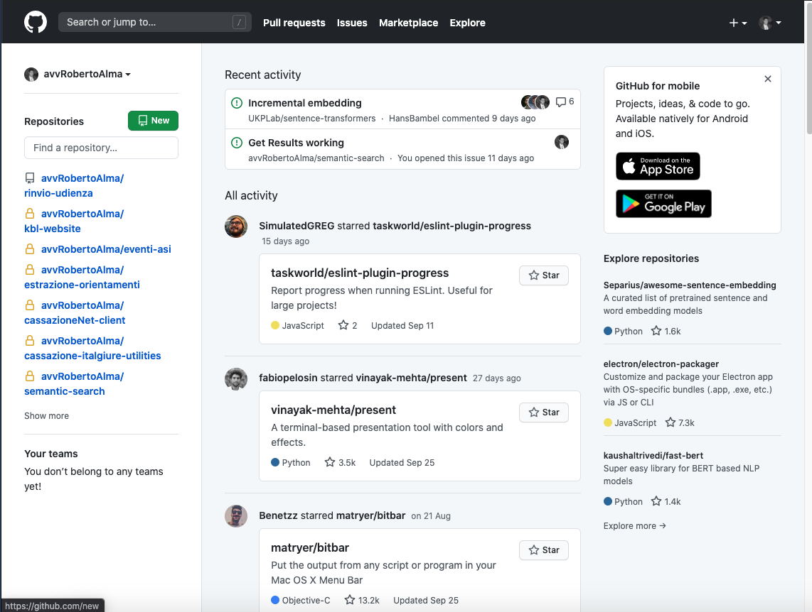
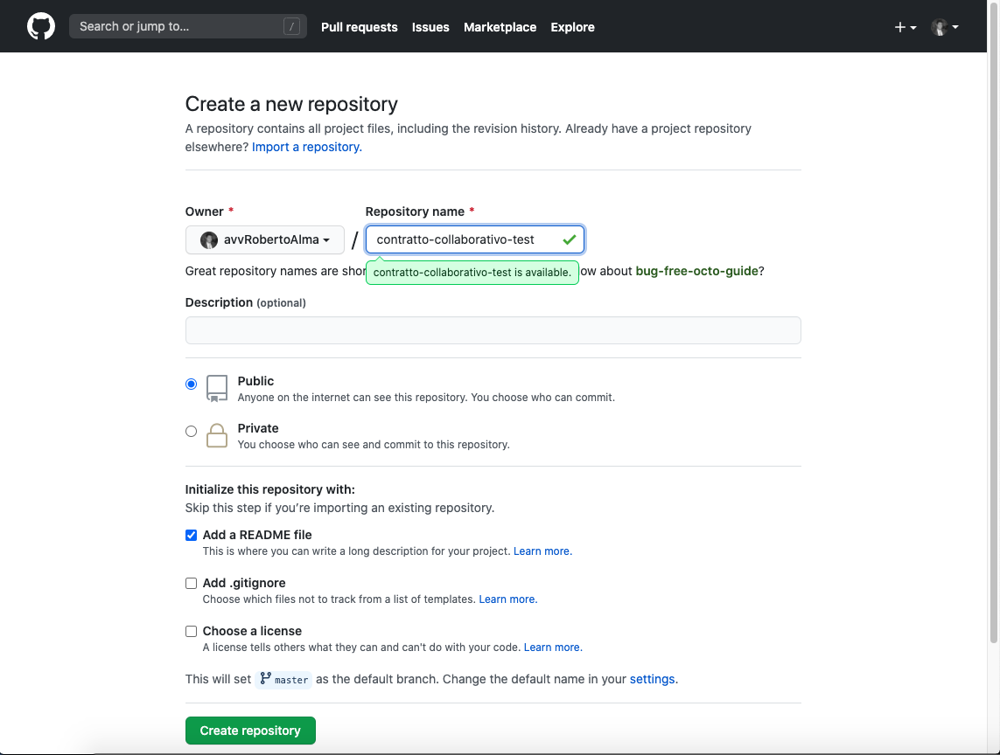
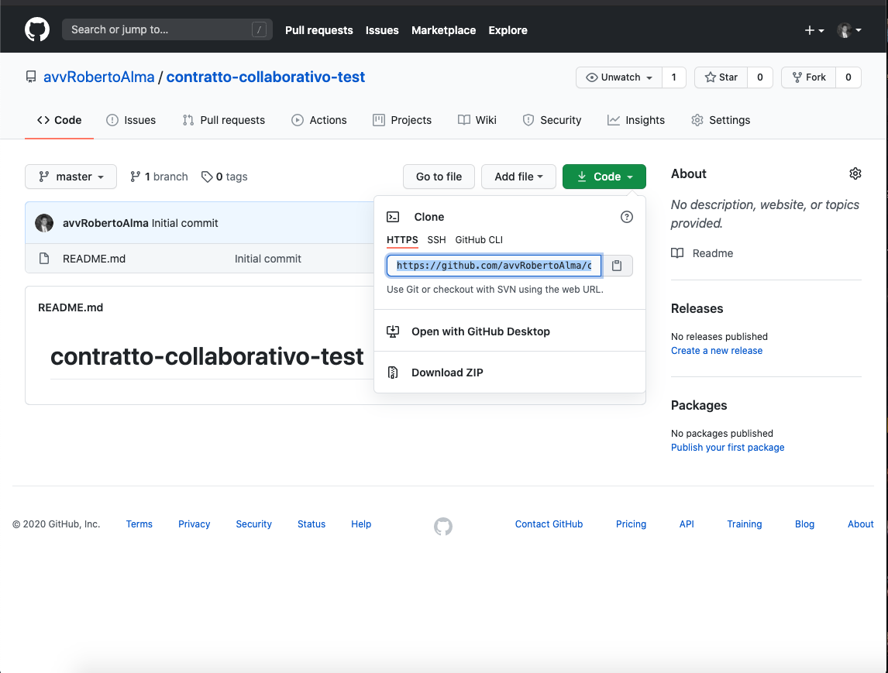
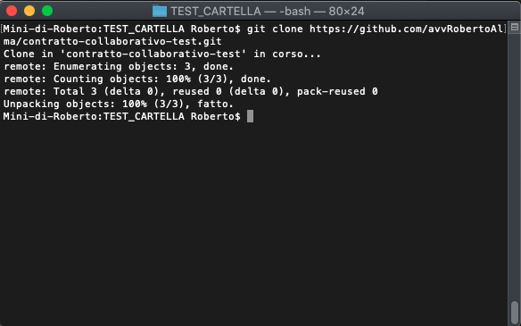
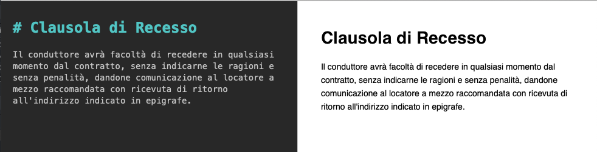
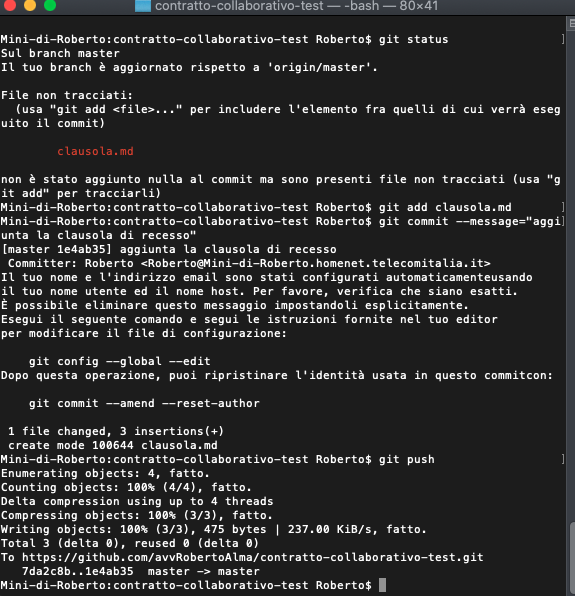
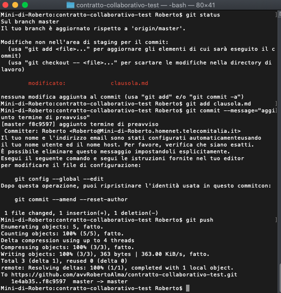
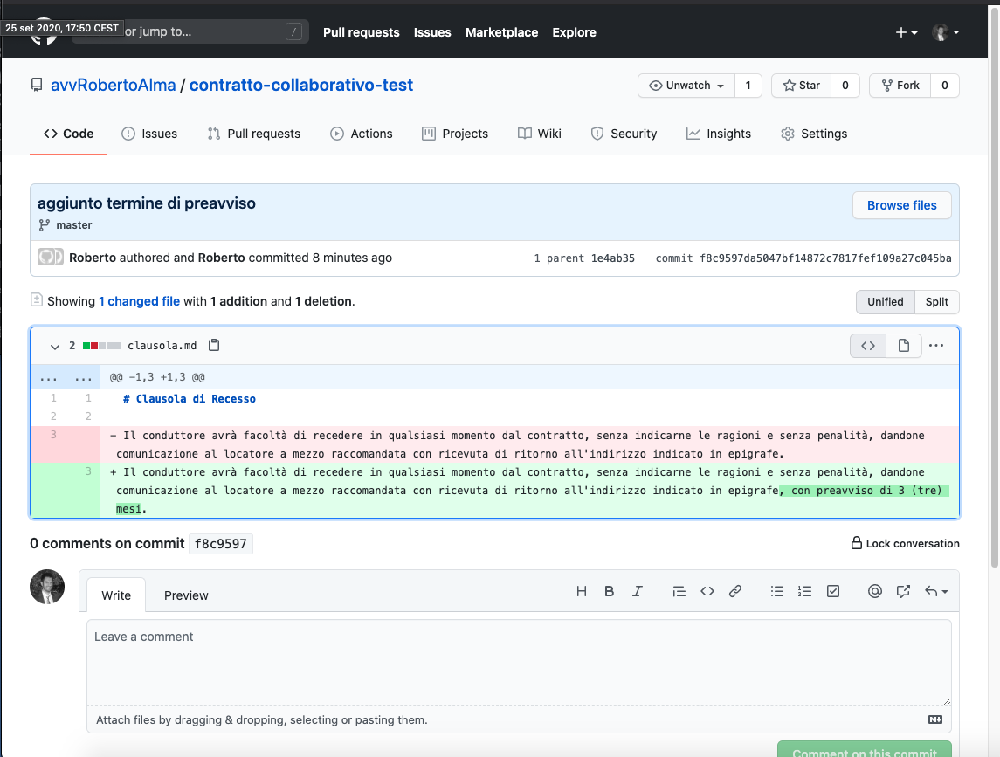
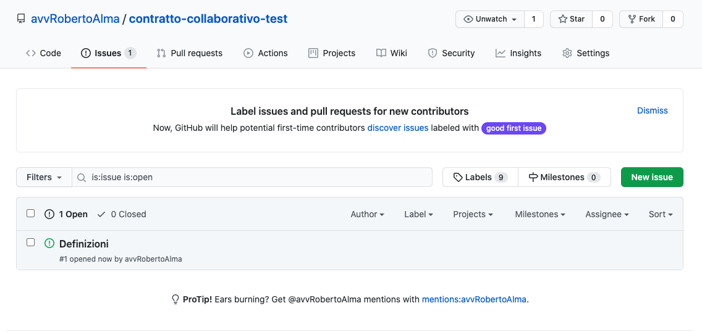

# Git e GitHub

## Introduzione

`GIT` è un programma estremamente utile per lo sviluppo software, in quanto consente di gestire in modo efficace le versioni del *software* realizzato. 

Per utilizzare un parallelismo con il mondo legale è un programma che si avvicina allo strumento revisioni e commenti dei comuni programmi di videoscrittura, anche se è molto più potente.

Il controllo di versione è, infatti, un meccanismo attraverso il quale tenere traccia delle modifiche apportate ad un determinato progetto (costituito da un singolo file o da un insieme di file).

Il vantaggio è quello di poter esaminare tutte le modifiche che sono state apportate ai singoli elementi del progetto e di poter facilmente ripristinare uno stato precedente, ove necessario.

`GITHUB` è, invece, un servizio di *hosting* e di collaborazione per *team* che si basa sulle funzionalità di `GIT`.

Contiene il codice sorgente di innumerevoli progetti *software* ai quali è possibile partecipare, in varie modalità:

- evidenziando errori da correggere;
- indicando ulteriori funzionalità che potrebbero essere sviluppate;
- proponendo modifiche effettive al codice sorgente (ossia effettuare le modifiche, caricarle sulla piattaforma ed attendere l'approvazione dell'amministratore del singolo progetto).

## Le basi di GIT

### Il Repository

Il **Repository** consiste in un archivio per la raccolta delle risorse relative ad un determinato progetto.

> Potrebbe essere costituito da tutti i file che compongono un applicativo software, ad esempio. In ambito legale potrebbe essere costituito dal contratto principale, dai documenti preparatori e dai relativi allegati.

La particolarità di `GIT` sta nel fatto che di ogni progetto vengono memorizzate delle istantanee (ossia delle copie del progetto ad un determinato momento con tutti i suoi elementi), contenenti i file modificati e i collegamenti ai file che, invece, non sono stati modificati.

Esempio pratico: supponiamo di avviare un progetto denominato Locazione e di inserire il contratto di locazione come primo documento nello stato iniziale (poi ci soffermeremo meglio su questa tematica). Nello stato successivo, aggiungeremo la ricevuta di pagamento del deposito cauzionale. Nello stato ancora successivo, invece, apporteremo delle modifiche al contratto. Avremo, quindi, tre strati:

- **Iniziale**: contratto di locazione (FILE);
- **Secondo**: ricevuta di pagamento del deposito cauzionale (NUOVO FILE) e contratto di locazione (COLLEGAMENTO AL PRIMO STATO, in quanto non modificato)
- **Terzo**: ricevuta di pagamento del deposito cauzionale (COLLEGAMENTO AL SECONDO STATO, in quanto non modificato) e contratto di locazione (FILE MODIFICATO).

### Branch

Possiamo definire il **branch** come una categoria del **Repository**. Di norma, un **Repository** deve avere almeno un **branch** (quello di default si chiama, per convenzione, *master*) e potrebbe avere sempre e soltanto un *branch*. Nei progetti più complessi, tuttavia, spesso vengono generati più *branch*, specialmente quando si stia cercando di sviluppare funzionalità particolarmente complesse e che potrebbero creare conflitti o impattare negativamente sul progetto. Terminato lo sviluppo si effettua la fusione tra i *branch* per riportare le modifiche del branch B in quello principale.

Se considerassimo il **Repository** come un armadio in cui riporre i faldoni, il **branch** potrebbe essere considerato come uno scaffale in cui inserire le singole pratiche.


### Commit, push e pull

`commit`, `push` e `pull` sono i tre comandi basilari principali per lavorare con `git`.

Il `commit` può essere definito come l'insieme dei cambiamenti apportati al codice di un progetto da un singolo sviluppatore.

Per tornare all'esempio del contratto di locazione, i tre differenti stati che abbiamo indicato sono, più precisamente, tre *commit*. Nel *commit* n. 2, a titolo esemplificativo, è stato aggiunto un nuovo file (ossia la ricevuta di pagamento del deposito cauzionale).

Per inviare materialmente questo *commit* al **Repository** remoto, si utilizza il comando `git push`, mediante il quale sono acquisite le modifiche apportate che vengono, pertanto, rese disponibili agli altri partecipanti al progetto.

Il **Pull** è, invece, l'azione inversa. Con il comando `git pull`, ogni partecipante al progetto può scaricare gli aggiornamenti al **Repository** e, quindi, fare in modo che la propria copia locale sia sincronizzata con il server remoto.

## Esercitazione pratica: Github per la redazione di un documento legale

### Installazione di GIT

Prima di tutto è necessario installare il programma `git` sul proprio sistema operativo.

Su sistemi Linux (Ubuntu/Debian) è sufficiente aprire il terminale e digitare:

```
sudo apt-get update
sudo apt-get install git
```

Su sistemi Apple o Windows è sufficiente scaricare l'ultima versione del programma dal [sito ufficiale del progetto](https://git-scm.com/downloads)

### Creazione di un repository su Github

A questo punto è necessario aver attivato un *account* su GitHub e cliccare sull'icona `New` in alto a sinistra per creare un nuovo **Repository**



Possiamo a questo punto inserire le informazioni principali del nostro nuovo **Repository**:

- nome del **Repository**
- se renderlo pubblico o privato
- se utilizzare una specifica licenza
- se aggiungere un file README (scelta consigliata)



Ci troviamo, a questo punto, nella schermata generale del **Repository**. Man mano che aggiungeremo i documenti del progetto, potremo sfruttare tutte le funzionalità della *Dashboard* di GitHub. Ora è solo necessario clonare il **Repository** sul proprio ambiente di lavoro in locale, per poter iniziare a lavorare. 



Per clonare il **Repository** sul proprio computer, utilizzeremo i comandi di **GIT** che sopra abbiamo illustrato.

Sarà sufficiente utilizzare il terminale per recarsi nella cartella desiderata, utilizzando il comando `cd` seguito dal percorso di destinazione e a quel punto dovremo lanciare il comando `git clone` seguito dal percorso remoto del nostro repository.



Finalmente abbiamo configurato l'ambiente locale con la copia del nostro **Repository** e possiamo iniziare a lavorare.

Creiamo un nuovo file, con il comando `touch` ad esempio:

`touch clausola_recesso.md`

Successivamente, con il nostro editor preferito potremo modificare questo file, inserendo il contenuto desiderato.



Ora, per pubblicare la modifica effettuata sul nostro **Repository** non dovremo fare altro che impostare il `commit` aggiungendo il nuovo file e successivamente eseguendo il comando `git push`



Ora spieghiamo passo passo le istruzioni eseguite.

1. `git status` è un'istruzione utile per sapere quali file sono stati creati/modificati/eliminati rispetto a quanto risulta nel serve remoto (una sorta di riepilogo). Il sistema ci dice che l'unico file differente è `clausola.md` ossia il file che abbiamo generato prima e poi modificato nell'editor;
2. `git add clausola.md` è l'istruzione tramite la quale il nuovo file `clausola.md` viene aggiunto al **commit**;
3. `git commit --message="aggiunta la clausola di recesso"` è l'istruzione con la quale viene creato il nuovo **commit** con la relativa descrizione (per utile riferimento)
4. `git push` finalmente viene inviato il commit al **Repository**

Accedendo al nostro **Repository** troveremo infatti la nostra clausola.


Effettuiamo qualche modifica alla clausola, per esempio, inserendo un termine di preavviso.

Torniamo sul terminale e, per sicurezza, eseguiamo il comando `git pull` per essere certi di avere gli ultimi aggiornamenti del **Repository**.



Il codice dovrebbe essere di immediata comprensione. 

Sostanzialmente:

- `git status` ci dice che l'unico file differente è `clausola.md` ossia il file che abbiamo appena modificato;
2. `git add clausola.md` è l'istruzione tramite la quale il file modificato `clausola.md` viene aggiunto al **commit**;
3. `git commit --message="aggiunto termine di preavviso"` è l'istruzione con la quale viene creato il nuovo **commit** con la relativa descrizione (per utile riferimento)
4. `git push` finalmente viene inviato il commit al **Repository**

Dalla *Dashboard* del **Repository** possiamo cliccare sull'id del **commit** e vedere le differenze rispetto alla versione immediatamente precedente.



E ovviamente si può iniziare la discussione, inserendo i relativi commenti.

Un'altra comoda funzione di GitHub è la sezione `Issues`, all'interno della quale si possono avviare *segnalazioni* che potranno essere gestite in modo collaborativo, assegnandole ad un partecipante del team, assegnando un livello di priorità, un'etichetta, ecc.



A questo punto, abbiamo reso operativo il nostro **Repository** legale. Non resta che lavorare per migliorare quella clausola!

In questa lezione, comunque, abbiamo appreso le basi per poter lavorare con `GIT` anche in ambito legale.
