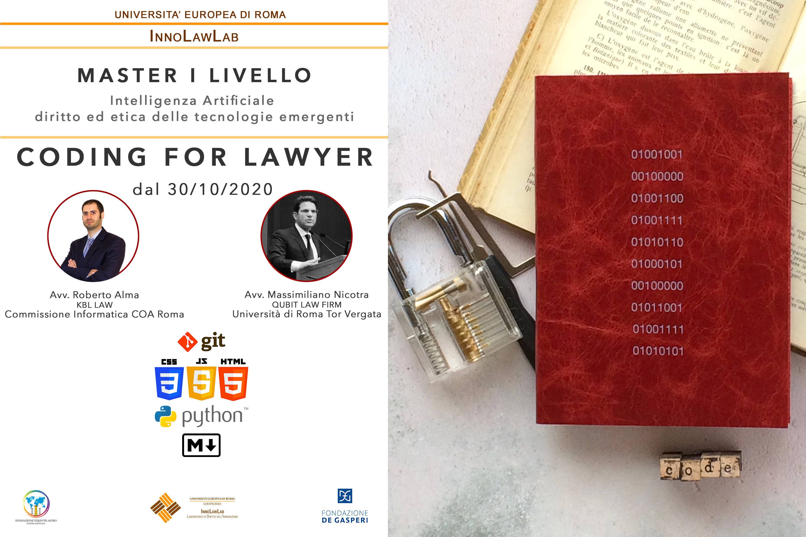

# Presentazione del Corso

Questo corso di informatica per avvocati è stato realizzato all'interno del Master di I Livello (2020) in Intelligenza Artificiale, diritto ed etica delle tecnologie emergenti, presso l'Università Europea di Roma.

## I docenti

### Avv. Roberto Alma

Avvocato e fondatore dello studio [KBL LAW](https://kbl-law.com). Si occupa principalmente di Diritto dell'informatica, privacy, proprietà intellettuale e diritto commerciale e societario, M&A ed Operazioni Straordinarie. Fermamente convinto che nell'epoca attuale, un consulente legale debba avere una approfondita conoscenza delle tecnologie dell'informazione. Pertanto, anche per passione personale, studia dal 2015 tecniche e linguaggi di programmazione. In particolare, ha una buona conoscenza di Javascript (ES6) e della programmazione back-end (Node.js e Python) e front-end (React.js e Vue.js come framework front-end). Ritiene che le tecnologie dell'informazione possano essere un ottimo strumento per innovare ed ottimizzare la professione legale e, in particolare, ho realizzato alcune applicazioni per l'automazione dello studio legale (con particolare riferimento alla generazione automatica di documentazione legale). 

[Profilo LinkedIn](https://www.linkedin.com/in/robertoalma/)

### Avv. Massimiliano Nicotra

Avvocato, si occupa di diritto della tecnologia da oltre vent'anni, è Data Protection Officer di società multinazionali e professore a contratto in “Fondamenti ed evoluzione dell’amministrazione digitale”, coordinatore della sezione Privacy e Compliance del Centro di Ricerca Economica e Giuridica nonché Vicepresidente del Comitato Strategico del Centro di Ricerca sull’Amministrazione Digitale presso l'Università degli Studi di Roma Tor Vergata, Dipartimento di Economia e docente nel corso di alta specializzazione in Responsabile della protezione dei dati e sicurezza delle informazioni, nonché auditor ISO/IEC 27001:2015.

[Profilo Linkedin](https://www.linkedin.com/in/massimiliano-nicotra-38757328/)

### Descrizione del corso

Il corso tratta i seguenti aspetti:

1. [Introduzione al pensiero computazionale](https://github.com/avvRobertoAlma/corso-informatica-avvocati/blob/master/01-Introduzione-al-pensiero-computazionale.md)

2. [Introduzione ai comandi da terminale](https://github.com/avvRobertoAlma/corso-informatica-avvocati/blob/master/02-comandi-shell.md)

3. [Introduzione alla programmazione WEB](https://github.com/avvRobertoAlma/corso-informatica-avvocati/blob/master/03-HTML-CSS-JS.md)

4. [Introduzione al linguaggio Markdown](https://github.com/avvRobertoAlma/corso-informatica-avvocati/blob/master/04-markdown.md)

5. [Basi di Git e GitHub](https://github.com/avvRobertoAlma/corso-informatica-avvocati/blob/master/05-git-basi.md)

6. **Programmazione con Python**

   1. [Variabili e tipi di dati](https://github.com/avvRobertoAlma/corso-informatica-avvocati/blob/master/06-01-python-variabili-e-dati.md)

   2. [Controllo dell'esecuzione del programma](https://github.com/avvRobertoAlma/corso-informatica-avvocati/blob/master/06-02-python-controllo-esecuzione-programma.md)

   3. [Liste](https://github.com/avvRobertoAlma/corso-informatica-avvocati/blob/master/06-03-liste.md)

   4. [Funzioni](https://github.com/avvRobertoAlma/corso-informatica-avvocati/blob/master/06-04-python-funzioni.md)

   5. [Lavorare con i file](https://github.com/avvRobertoAlma/corso-informatica-avvocati/blob/master/06-05-python-lavorare-con-files.md)

   6. [Classi ed oggetti](https://github.com/avvRobertoAlma/corso-informatica-avvocati/blob/master/06-06-python-classi-oggetti.md)

      